# Comprehensive HackingTool Report

## Executive Summary

This comprehensive report documents **78 specialized tools** organized across **18 distinct categories** within the HackingTool project. The tools span the entire penetration testing lifecycle from reconnaissance to post-exploitation, covering network attacks, web application testing, social engineering, wireless security, and forensic analysis.

---

## Table of Contents

1. [Anonymously Hiding Tools](#1-anonymously-hiding-tools)
2. [Information Gathering Tools](#2-information-gathering-tools)
3. [Wordlist Generator](#3-wordlist-generator)
4. [Wireless Attack Tools](#4-wireless-attack-tools)
5. [SQL Injection Tools](#5-sql-injection-tools)
6. [Phishing Attack Tools](#6-phishing-attack-tools)
7. [Web Attack Tools](#7-web-attack-tools)
8. [Post Exploitation Tools](#8-post-exploitation-tools)
9. [Forensic Tools](#9-forensic-tools)
10. [Payload Creation Tools](#10-payload-creation-tools)
11. [Exploit Framework](#11-exploit-framework)
12. [Reverse Engineering Tools](#12-reverse-engineering-tools)
13. [DDOS Attack Tools](#13-ddos-attack-tools)
14. [Remote Administrator Tools (RAT)](#14-remote-administrator-tools-rat)
15. [XSS Attack Tools](#15-xss-attack-tools)
16. [Steganography Tools](#16-steganography-tools)
17. [Other Tools](#17-other-tools)
18. [Tool Manager](#18-tool-manager)

---

## 1. Anonymously Hiding Tools

**Purpose:** Anonymization and privacy protection during security testing

| # | Tool Name | Description | Project URL |
|---|-----------|-------------|-------------|
| 1 | **AnonSurf** | Automatically overwrites RAM when system shuts down and changes IP to maintain anonymity | https://github.com/Und3rf10w/kali-anonsurf |
| 2 | **Multitor** | Enables multiple simultaneous Tor connections for distributed anonymity | https://github.com/trimstray/multitor |

**Total Tools: 2**

---

## 2. Information Gathering Tools

**Purpose:** Reconnaissance and discovery of targets, networks, and services

| # | Tool Name | Description | Project URL |
|---|-----------|-------------|-------------|
| 3 | **Network Map (nmap)** | Free and open source utility for network discovery and security auditing | https://github.com/nmap/nmap |
| 4 | **Dracnmap** | Exploits network and gathers information using nmap help | https://github.com/Screetsec/Dracnmap |
| 5 | **Port scanning** | Simple port scanner using nmap | Native tool |
| 6 | **Host to IP** | Convert hostname to IP address | Native tool |
| 7 | **Xerosploit** | Penetration testing toolkit for MITM attacks | https://github.com/LionSec/xerosploit |
| 8 | **RED HAWK** | All-in-one tool for Information Gathering and Vulnerability Scanning | https://github.com/Tuhinshubhra/RED_HAWK |
| 9 | **ReconSpider** | Advanced OSINT Framework for scanning IP, Emails, Websites, Organizations | https://github.com/bhavsec/reconspider |
| 10 | **IsItDown** | Check if website is online or offline | https://isitdownrightnow.com |
| 11 | **Infoga** | Email OSINT - gathers email accounts information from public sources | https://github.com/m4ll0k/Infoga |
| 12 | **ReconDog** | Information Gathering Suite | https://github.com/s0md3v/ReconDog |
| 13 | **Striker** | Recon & Vulnerability Scanning Suite | https://github.com/s0md3v/Striker |
| 14 | **SecretFinder** | Find sensitive data like API keys, access tokens, authorizations, JWT | https://github.com/m4ll0k/SecretFinder |
| 15 | **Find Info Using Shodan** | Get ports, vulnerabilities, banners for any IP with Shodan | https://github.com/m4ll0k/Shodanfy.py |
| 16 | **Port Scanner - rang3r** | Multi-threaded port scanner for alive hosts | https://github.com/floriankunushevci/rang3r |
| 17 | **Breacher** | Advanced multithreaded admin panel finder | https://github.com/s0md3v/Breacher |

**Total Tools: 14**

---

## 3. Wordlist Generator

**Purpose:** Password wordlist creation and credential generation

| # | Tool Name | Description | Project URL |
|---|-----------|-------------|-------------|
| 18 | **Cupp** | Interactive tool for creating targeted password wordlists based on personal information | https://github.com/Mebus/cupp |
| 19 | **WordlistCreator** | C program to create all password possibilities with customizable parameters | https://github.com/Z4nzu/wlcreator |
| 20 | **Goblin WordGenerator** | Wordlist generation tool | https://github.com/UndeadSec/GoblinWordGenerator |
| 21 | **Password list (1.4 Billion Clear Text Password)** | Database of 1.4 billion clear text credentials from BreachCompilation | https://github.com/Viralmaniar/SMWYG-Show-Me-What-You-Got |

**Total Tools: 4**

---

## 4. Wireless Attack Tools

**Purpose:** Wireless network security assessment and attacks

| # | Tool Name | Description | Project URL |
|---|-----------|-------------|-------------|
| 22 | **WiFi-Pumpkin** | Rogue AP framework to create fake networks while forwarding legitimate traffic | https://github.com/P0cL4bs/wifipumpkin3 |
| 23 | **pixiewps** | Tool to bruteforce offline WPS pin exploiting low entropy of Access Points | https://github.com/wiire/pixiewps |
| 24 | **Bluetooth Honeypot GUI Framework** | Bluetooth honeypot for testing and security research | https://github.com/andrewmichaelsmith/bluepot |
| 25 | **Fluxion** | Automated wireless attack tool - remake of linset with enhanced functionality | https://github.com/FluxionNetwork/fluxion |
| 26 | **Wifiphisher** | Rogue Access Point framework for red team engagements and Wi-Fi security testing | https://github.com/wifiphisher/wifiphisher |
| 27 | **Wifite** | Automated wireless attack tool | https://github.com/derv82/wifite2 |
| 28 | **EvilTwin** | FakeAP script for Evil Twin Attack using fake page and Fake Access Point | https://github.com/Z4nzu/fakeap |
| 29 | **Fastssh** | Multi-threaded scan and brute force attack against SSH protocol | https://github.com/Z4nzu/fastssh |
| 30 | **Howmanypeople** | Count people around by monitoring WiFi signals | Python package |

**Total Tools: 9**

---

## 5. SQL Injection Tools

**Purpose:** Detection and exploitation of SQL injection vulnerabilities

| # | Tool Name | Description | Project URL |
|---|-----------|-------------|-------------|
| 31 | **Sqlmap** | Automated penetration testing tool for detecting and exploiting SQL injection flaws | https://github.com/sqlmapproject/sqlmap |
| 32 | **NoSqlMap** | Python tool for auditing and automating NoSQL injection attacks | https://github.com/codingo/NoSQLMap |
| 33 | **Damn Small SQLi Scanner (DSSS)** | Fully functional SQL injection vulnerability scanner for GET and POST parameters | https://github.com/stamparm/DSSS |
| 34 | **Explo** | Simple tool to describe web security issues in human and machine readable format | https://github.com/dtag-dev-sec/explo |
| 35 | **Blisqy** | Exploit time-based blind SQL injection on HTTP headers | https://github.com/JohnTroony/Blisqy |
| 36 | **Leviathan** | Wide Range Mass Audit Toolkit with SQL injection detection | https://github.com/leviathan-framework/leviathan |
| 37 | **SQLScan** | Quick web scanner to find SQL injection points | https://github.com/Cvar1984/sqlscan |

**Total Tools: 7**

---

## 6. Phishing Attack Tools

**Purpose:** Social engineering and credential harvesting through fake login pages

| # | Tool Name | Description | Project URL |
|---|-----------|-------------|-------------|
| 38 | **Autophisher RK** | Automated Phishing Toolkit | https://github.com/CodingRanjith/autophisher |
| 39 | **Pyphisher** | Easy to use phishing tool with 77 website templates | https://github.com/KasRoudra/PyPhisher |
| 40 | **AdvPhishing** | Advanced Phishing Tool with OTP phishing capabilities | https://github.com/Ignitetch/AdvPhishing |
| 41 | **Setoolkit** | Social-Engineer Toolkit - open-source penetration testing framework | https://github.com/trustedsec/social-engineer-toolkit |
| 42 | **SocialFish** | Automated Phishing Tool & Information Collector | https://github.com/UndeadSec/SocialFish |
| 43 | **HiddenEye** | Modern Phishing Tool with advanced functionality and multiple tunnelling services | https://github.com/Morsmalleo/HiddenEye |
| 44 | **Evilginx2** | Man-in-the-middle attack framework for phishing login credentials and session cookies | https://github.com/kgretzky/evilginx2 |
| 45 | **I-See_You** | Find exact location of victim by social engineering or phishing | https://github.com/Viralmaniar/I-See-You |
| 46 | **SayCheese** | Take webcam shots from target by sending malicious link | https://github.com/hangetzzu/saycheese |
| 47 | **QR Code Jacking** | Generate QR codes for phishing (Any Website) | https://github.com/cryptedwolf/ohmyqr |
| 48 | **BlackEye** | Ultimate phishing tool with 38 websites available | https://github.com/An0nUD4Y/blackeye |
| 49 | **ShellPhish** | Phishing Tool for 18 social media platforms | https://github.com/An0nUD4Y/shellphish |
| 50 | **Thanos** | Browser to Browser Phishing toolkit | https://github.com/TridevReddy/Thanos |
| 51 | **QRLJacking** | QR Code phishing attack tool | https://github.com/OWASP/QRLJacking |
| 52 | **BlackPhish** | Mobile-friendly phishing page tool | https://github.com/iinc0gnit0/BlackPhish |
| 53 | **Maskphish** | Hide phishing URL under normal looking URL | https://github.com/jaykali/maskphish |
| 54 | **dnstwist** | Domain name permutation engine for detecting typo-squatting | https://github.com/elceef/dnstwist |

**Total Tools: 17**

---

## 7. Web Attack Tools

**Purpose:** Web application security testing and exploitation

| # | Tool Name | Description | Project URL |
|---|-----------|-------------|-------------|
| 55 | **Web2Attack** | Web hacking framework with tools and exploits | https://github.com/santatic/web2attack |
| 56 | **Skipfish** | Fully automated, active web application security reconnaissance tool | Kali native tool |
| 57 | **SubDomain Finder** | Enumerate subdomains of websites using OSINT | https://github.com/aboul3la/Sublist3r |
| 58 | **CheckURL** | Detect evil URLs using IDN Homograph Attack | https://github.com/UndeadSec/checkURL |
| 59 | **Blazy** | Modern login page bruteforcer with ClickJacking detection | https://github.com/UltimateHackers/Blazy |
| 60 | **Sub-Domain TakeOver** | Detect and exploit sub-domain takeover vulnerabilities | https://github.com/edoardottt/takeover |
| 61 | **Dirb** | Web Content Scanner for existing and hidden web objects | https://gitlab.com/kalilinux/packages/dirb |

**Total Tools: 7**

---

## 8. Post Exploitation Tools

**Purpose:** Maintaining access and escalating privileges after initial compromise

| # | Tool Name | Description | Project URL |
|---|-----------|-------------|-------------|
| 62 | **Vegile - Ghost In The Shell** | Backdoor/rootkit that hides processes, unlimited sessions in Metasploit | https://github.com/Screetsec/Vegile |
| 63 | **Chrome Keylogger** | Keylogger for Chrome browser | https://github.com/UndeadSec/HeraKeylogger |

**Total Tools: 2**

---

## 9. Forensic Tools

**Purpose:** Digital forensics and incident response

| # | Tool Name | Description | Project URL |
|---|-----------|-------------|-------------|
| 64 | **Autopsy** | Platform used by Cyber Investigators for file recovery and analysis | Native tool |
| 65 | **Wireshark** | Network capture and analyzer for investigating network incidents | Native tool |
| 66 | **Bulk extractor** | Extract useful information without parsing the file system | https://github.com/simsong/bulk_extractor |
| 67 | **Disk Clone and ISO Image Acquire** | Free forensic imager for media acquisition | https://guymager.sourceforge.io |
| 68 | **Toolsley** | Collection of 10+ useful tools for investigation | https://www.toolsley.com |
| 69 | **Volatility3** | Advanced memory forensics framework | https://github.com/volatilityfoundation/volatility3 |

**Total Tools: 6**

---

## 10. Payload Creation Tools

**Purpose:** Generating malicious payloads and backdoors

| # | Tool Name | Description | Project URL |
|---|-----------|-------------|-------------|
| 70 | **The FatRat** | Easy way to create backdoors and payloads that bypass most anti-virus | https://github.com/Screetsec/TheFatRat |
| 71 | **Brutal** | Toolkit to quickly create various payloads and launch attacks for HID | https://github.com/Screetsec/Brutal |
| 72 | **Stitch** | Cross Platform Python Remote Administrator Tool | https://nathanlopez.github.io/Stitch |
| 73 | **MSFvenom Payload Creator** | Wrapper to generate multiple types of payloads based on user choice | https://github.com/g0tmi1k/msfpc |
| 74 | **Venom Shellcode Generator** | Malicious server exploits to deliver LAN payloads via fake webpages | https://github.com/r00t-3xp10it/venom |
| 75 | **Spycam** | Generates payload that captures webcam images every minute | https://github.com/indexnotfound404/spycam |
| 76 | **Mob-Droid** | Generates Metasploit payloads easily without long commands | https://github.com/kinghacker0/Mob-Droid |
| 77 | **Enigma** | Multiplatform payload dropper | https://github.com/UndeadSec/Enigma |

**Total Tools: 8**

---

## 11. Exploit Framework

**Purpose:** Framework for exploiting vulnerabilities in various systems

| # | Tool Name | Description | Project URL |
|---|-----------|-------------|-------------|
| 78 | **RouterSploit** | Open-source exploitation framework dedicated to embedded devices | https://github.com/threat9/routersploit |
| 79 | **WebSploit** | Advanced MITM framework | https://github.com/The404Hacking/websploit |
| 80 | **Commix** | Automated All-in-One OS command injection and exploitation tool | https://github.com/commixproject/commix |

**Total Tools: 3**

---

## 12. Reverse Engineering Tools

**Purpose:** Analysis and decompilation of applications

| # | Tool Name | Description | Project URL |
|---|-----------|-------------|-------------|
| 81 | **Androguard** | Reverse engineering, Malware and goodware analysis of Android applications | https://github.com/androguard/androguard |
| 82 | **Apk2Gold** | CLI tool for decompiling Android apps to Java | https://github.com/lxdvs/apk2gold |
| 83 | **JadX** | Dex to Java decompiler - decompile Dalvik bytecode from APK files | https://github.com/skylot/jadx |

**Total Tools: 3**

---

## 13. DDOS Attack Tools

**Purpose:** Denial of service testing and attacks

| # | Tool Name | Description | Project URL |
|---|-----------|-------------|-------------|
| 84 | **SlowLoris** | HTTP Denial of Service attack using lots of HTTP requests | Python package |
| 85 | **Asyncrone** | Multifunction SYN Flood DDoS Weapon written in C | https://github.com/fatihsnsy/aSYNcrone |
| 86 | **UFONet** | Free software toolkit for DoS and DDoS attacks | https://github.com/epsylon/ufonet |
| 87 | **GoldenEye** | Python app for HTTP DoS testing | https://github.com/jseidl/GoldenEye |
| 88 | **SaphyraDDoS** | Complex Python DDoS tool with easy usage | https://github.com/anonymous24x7/Saphyra-DDoS |

**Total Tools: 5**

---

## 14. Remote Administrator Tools (RAT)

**Purpose:** Remote system administration and control

| # | Tool Name | Description | Project URL |
|---|-----------|-------------|-------------|
| 89 | **Stitch** | Cross platform Python RAT for building custom payloads | https://github.com/nathanlopez/Stitch |
| 90 | **Pyshell** | RAT tool for downloading/uploading files, executing OS commands | https://github.com/knassar702/pyshell |

**Total Tools: 2**

---

## 15. XSS Attack Tools

**Purpose:** Cross-site scripting detection and exploitation

| # | Tool Name | Description | Project URL |
|---|-----------|-------------|-------------|
| 91 | **DalFox** | XSS Scanning and Parameter Analysis tool | https://github.com/hahwul/dalfox |
| 92 | **XSS Payload Generator** | XSS scanner and payload generator | https://github.com/capture0x/XSS-LOADER |
| 93 | **Extended XSS Searcher and Finder** | Extended XSS detection tool | https://github.com/Damian89/extended-xss-search |
| 94 | **XSS-Freak** | XSS scanner written in Python 3 | https://github.com/PR0PH3CY33/XSS-Freak |
| 95 | **XSpear** | XSS Scanner built on Ruby Gems | https://github.com/hahwul/XSpear |
| 96 | **XSSCon** | Lightweight XSS scanner | https://github.com/menkrep1337/XSSCon |
| 97 | **XanXSS** | Reflected XSS searching tool with payload templates | https://github.com/Ekultek/XanXSS |
| 98 | **XSStrike** | Advanced XSS Detection Suite | https://github.com/UltimateHackers/XSStrike |
| 99 | **RVuln** | Multi-threaded automated web vulnerability scanner written in Rust | https://github.com/iinc0gnit0/RVuln |

**Total Tools: 9**

---

## 16. Steganography Tools

**Purpose:** Hidden data embedding and extraction

| # | Tool Name | Description | Project URL |
|---|-----------|-------------|-------------|
| 100 | **SteganoHide** | Hide and extract data in images | Native tool |
| 101 | **StegnoCracker** | Uncover hidden data inside files using brute-force | Python package |
| 102 | **StegoCracker** | Hide and retrieve data in image or audio files | https://github.com/W1LDN16H7/StegoCracker |
| 103 | **Whitespace** | Use whitespace and unicode characters for steganography | https://github.com/beardog108/snow10 |

**Total Tools: 4**

---

## 17. Other Tools

### 17.1 SocialMedia Bruteforce

| # | Tool Name | Description | Project URL |
|---|-----------|-------------|-------------|
| 104 | **Instagram Attack** | Brute force attack against Instagram | https://github.com/chinoogawa/instaBrute |
| 105 | **AllinOne SocialMedia Attack** | Brute force for Gmail, Hotmail, Twitter, Facebook, Netflix | https://github.com/Matrix07ksa/Brute_Force |
| 106 | **Facebook Attack** | Facebook BruteForcer | https://github.com/Matrix07ksa/Brute_Force |
| 107 | **Application Checker** | Check if app is installed on target device through a link | https://github.com/jakuta-tech/underhanded |

### 17.2 Android Hacking Tools

| # | Tool Name | Description | Project URL |
|---|-----------|-------------|-------------|
| 108 | **Keydroid** | Android Keylogger + Reverse Shell | https://github.com/F4dl0/keydroid |
| 109 | **MySMS** | Generate Android App to hack SMS through WAN | https://github.com/papusingh2sms/mysms |
| 110 | **Lockphish** | Grab Windows credentials, Android PIN, iPhone Passcode via https | https://github.com/JasonJerry/lockphish |
| 111 | **DroidCam** | Grab Front Camera Snap Using A Link | https://github.com/kinghacker0/WishFish |
| 112 | **EvilApp** | Generate Android App to hijack authenticated sessions in cookies | https://github.com/crypticterminal/EvilApp |

### 17.3 IDN Homograph Attack

| # | Tool Name | Description | Project URL |
|---|-----------|-------------|-------------|
| 113 | **EvilURL** | Generate unicode evil domains for IDN Homograph Attack | https://github.com/UndeadSec/EvilURL |

### 17.4 Email Verify Tools

| # | Tool Name | Description | Project URL |
|---|-----------|-------------|-------------|
| 114 | **Knockmail** | Verify if email exists | https://github.com/heywoodlh/KnockMail |

### 17.5 Hash Cracking Tools

| # | Tool Name | Description | Project URL |
|---|-----------|-------------|-------------|
| 115 | **Hash Buster** | Automatic hash type identification supporting MD5, SHA1, SHA256, SHA384, SHA512 | https://github.com/s0md3v/Hash-Buster |

### 17.6 Wifi Deauthenticate

| # | Tool Name | Description | Project URL |
|---|-----------|-------------|-------------|
| 116 | **WifiJammer-NG** | Continuously jam all WiFi clients and access points within range | https://github.com/MisterBianco/wifijammer-ng |
| 117 | **KawaiiDeauther** | Pentest toolkit for jamming WiFi clients/routers and spamming fake APs | https://github.com/aryanrtm/KawaiiDeauther |

### 17.7 SocialMedia Finder

| # | Tool Name | Description | Project URL |
|---|-----------|-------------|-------------|
| 118 | **Find SocialMedia By Facial Recognition** | Social Media Mapping Tool via facial recognition | https://github.com/Greenwolf/social_mapper |
| 119 | **Find SocialMedia By UserName** | Find usernames across 75+ social networks | https://github.com/xHak9x/finduser |
| 120 | **Sherlock** | Hunt down social media accounts by username | https://github.com/sherlock-project/sherlock |
| 121 | **SocialScan** | Check email and username availability on platforms | https://github.com/iojw/socialscan |

### 17.8 Payload Injector

| # | Tool Name | Description | Project URL |
|---|-----------|-------------|-------------|
| 122 | **Debinject** | Inject malicious code into .deb packages | https://github.com/UndeadSec/Debinject |
| 123 | **Pixload** | Image Payload Creating tools for creating/injecting payloads into images | https://github.com/chinarulezzz/pixload |

### 17.9 Web Crawling

| # | Tool Name | Description | Project URL |
|---|-----------|-------------|-------------|
| 124 | **Gospider** | Fast web spider written in Go | https://github.com/jaeles-project/gospider |

### 17.10 Mix Tools

| # | Tool Name | Description | Project URL |
|---|-----------|-------------|-------------|
| 125 | **Terminal Multiplexer** | Tiling terminal emulator for multiple sessions | Native tool (tilix) |
| 126 | **Crivo** | Extract and filter URLs, IPs, domains, subdomains from web pages | https://github.com/GMDSantana/crivo |

### 17.11 CloudFlare Bypass

| # | Tool Name | Description | Project URL |
|---|-----------|-------------|-------------|
| 127 | **HatCloud** | Bypass CloudFlare for discovering real IP | https://github.com/HatBashBR/HatCloud |

**Total Tools in Category: 24**

---

## 18. Tool Manager

**Purpose:** System maintenance and tool management

| # | Tool Name | Description |
|---|-----------|-------------|
| 128 | **Update Tool or System** | Update hackingtool or entire system |
| 129 | **Uninstall HackingTool** | Remove hackingtool from system |

**Total Tools: 2**

---

## Summary Statistics

| Metric | Count |
|--------|-------|
| **Total Tool Categories** | 18 |
| **Total Individual Tools** | 129 |
| **GitHub/External Tools** | ~110 |
| **Native/Kali Tools** | ~19 |

### Category Breakdown

| Category | Tool Count |
|----------|------------|
| Anonymously Hiding Tools | 2 |
| Information Gathering Tools | 14 |
| Wordlist Generator | 4 |
| Wireless Attack Tools | 9 |
| SQL Injection Tools | 7 |
| Phishing Attack Tools | 17 |
| Web Attack Tools | 7 |
| Post Exploitation Tools | 2 |
| Forensic Tools | 6 |
| Payload Creation Tools | 8 |
| Exploit Framework | 3 |
| Reverse Engineering Tools | 3 |
| DDOS Attack Tools | 5 |
| Remote Administrator Tools (RAT) | 2 |
| XSS Attack Tools | 9 |
| Steganography Tools | 4 |
| Other Tools (subcategories) | 24 |
| Tool Manager | 2 |

---

## Hidden and Hard-to-Spot Tools

Based on code analysis, the following tools are implemented but may not be immediately visible in the main README:

### Hidden Implementation Details

1. **dnstwist** - Domain permutation tool (line 218 in phising_attack.py)
2. **Volatility3** - Memory forensics framework (in forensic_tools.py)
3. **Asyncrone** - SYN Flood DDoS Weapon (in ddos.py)
4. **SaphyraDDoS** - Complex Python DDoS tool (in ddos.py)
5. **Extended XSS Searcher** - Requires manual configuration
6. **XanXSS** - Requires manual execution
7. **Extended XSS Finder** - Has post-install instructions
8. **Gospider** - Web crawling tool (in web_crawling.py)
9. **Crivo** - URL extraction tool (in mix_tools.py)
10. **Terminal Multiplexer** - Tilix integration

### Subtools Within Collections

Many collection classes contain additional subtools not listed in main documentation:

- **OtherTools** collection contains 10 different tool categories
- **SocialMediaBruteforceTools** contains 4 specific tools
- **AndroidAttackTools** contains 5 tools
- **SocialMediaFinderTools** contains 4 tools
- **PayloadInjectorTools** contains 2 tools
- **WifiJammingTools** contains 2 tools

---

## Architecture Overview

```mermaid
graph TD
    A[HackingTool Main Menu] --> B[AnonSurfTools]
    A --> C[InformationGatheringTools]
    A --> D[WordlistGeneratorTools]
    A --> E[WirelessAttackTools]
    A --> F[SqlInjectionTools]
    A --> G[PhishingAttackTools]
    A --> H[WebAttackTools]
    A --> I[PostExploitationTools]
    A --> J[ForensicTools]
    A --> K[PayloadCreatorTools]
    A --> L[ExploitFrameworkTools]
    A --> M[ReverseEngineeringTools]
    A --> N[DDOSTools]
    A --> O[RemoteAdministrationTools]
    A --> P[XSSAttackTools]
    A --> Q[SteganographyTools]
    A --> R[OtherTools]
    A --> S[ToolManager]

    R --> R1[SocialMediaBruteforceTools]
    R --> R2[AndroidAttackTools]
    R --> R3[IDNHomographAttackTools]
    R --> R4[EmailVerifyTools]
    R --> R5[HashCrackingTools]
    R --> R6[WifiJammingTools]
    R --> R7[SocialMediaFinderTools]
    R --> R8[PayloadInjectorTools]
    R --> R9[WebCrawlingTools]
    R --> R10[MixTools]
    R --> R11[HatCloud]
```

---

## Tool Distribution by Attack Phase

### Reconnaissance Phase
- Information Gathering Tools (14 tools)
- Wordlist Generator (4 tools)

### Initial Access
- Phishing Attack Tools (17 tools)
- Wireless Attack Tools (9 tools)
- Web Attack Tools (7 tools)

### Exploitation
- SQL Injection Tools (7 tools)
- XSS Attack Tools (9 tools)
- Exploit Framework (3 tools)
- DDOS Attack Tools (5 tools)

### Post-Exploitation
- Post Exploitation Tools (2 tools)
- Remote Administrator Tools (2 tools)
- Payload Creation Tools (8 tools)

### Analysis & Persistence
- Steganography Tools (4 tools)
- Forensic Tools (6 tools)
- Reverse Engineering Tools (3 tools)

### Anonymity
- Anonymously Hiding Tools (2 tools)

### Additional Capabilities
- Other Tools (24 tools)
- Tool Manager (2 tools)

---

## Dependencies and Requirements

### Common Dependencies
- Python 3.x
- Git
- Rich Console Library
- Various language-specific compilers (Go, Ruby, etc.)

### Operating System Compatibility
- Kali Linux
- Parrot OS
- Ubuntu/Debian-based distributions
- Some tools support Arch Linux

---

## Report Generated

**Date:** 2026-02-07
**Total Tools Documented:** 129
**Categories Covered:** 18
**Project Source:** HackingTool v1.2.0 by Z4nzu

---

## References

- Main Repository: https://github.com/Z4nzu/hackingtool
- Documentation: Built-in help and README files
- Installation: `python install.py`
- Execution: `sudo hackingtool`
