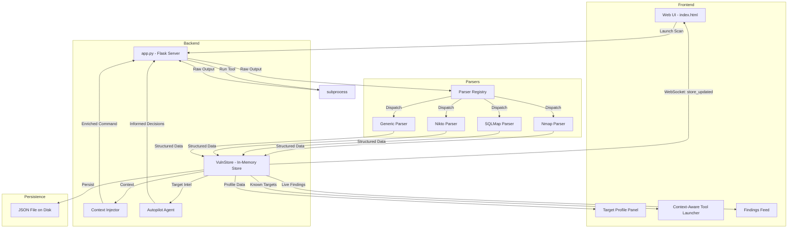
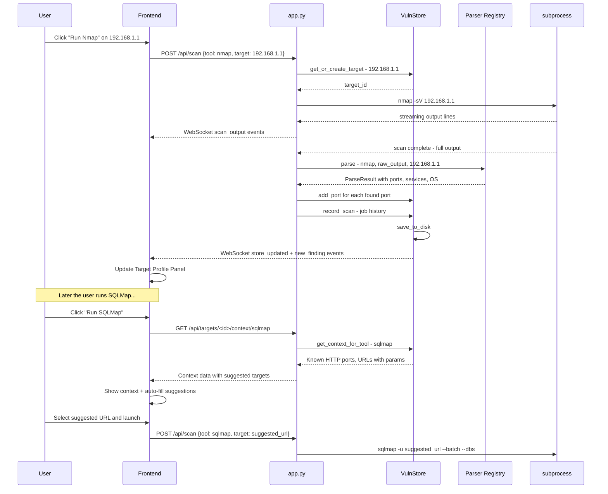

# Vulnerability Store — Session Persistence Architecture

## Problem Statement

Every tool in HackerDeX currently starts from **zero context**. When Nmap discovers port 80 on a target, SQLMap has no awareness of it. The user must manually re-type targets, re-specify ports, and mentally track findings across tools.

## Solution: The Vulnerability Store (VulnStore)

A **target-centric, in-memory data store** with JSON file persistence that:

1. Automatically extracts structured findings from tool outputs
2. Builds a **unified target profile** across all scans
3. Makes context available to other tools before they run
4. Feeds structured intelligence into the AI autopilot agent
5. Displays a live-updating Target Profile in the web UI

---

## System Architecture



---

## Data Model

### TargetProfile

Each unique target - identified by IP or domain - gets a single unified profile:

```python
TargetProfile = {
    "id": "sha256-hash-of-normalized-target",
    "target": "192.168.1.1",              # Primary identifier
    "aliases": ["192.168.1.1", "example.com"],  # All known names for this target
    "first_seen": "2026-02-07T06:50:00Z",
    "last_updated": "2026-02-07T07:15:00Z",

    "ports": [
        {
            "port": 80,
            "protocol": "tcp",
            "state": "open",
            "service": "http",
            "version": "Apache/2.4.41",
            "banner": "Apache/2.4.41 (Ubuntu)",
            "source_tool": "nmap",
            "source_job_id": "abc123",
            "discovered_at": "2026-02-07T06:52:00Z"
        }
    ],

    "technologies": [
        {
            "name": "Apache",
            "version": "2.4.41",
            "category": "web-server",
            "source_tool": "whatweb",
            "discovered_at": "2026-02-07T06:55:00Z"
        }
    ],

    "urls": [
        {
            "url": "http://example.com/admin",
            "status_code": 200,
            "content_type": "text/html",
            "source_tool": "katana",
            "discovered_at": "2026-02-07T07:00:00Z"
        }
    ],

    "vulnerabilities": [
        {
            "id": "VULN-001",
            "cve": "CVE-2021-XXXXX",
            "title": "SQL Injection in login form",
            "severity": "high",
            "details": "Parameter 'id' is vulnerable to boolean-based blind SQLi",
            "affected_url": "http://example.com/page?id=1",
            "source_tool": "sqlmap",
            "source_job_id": "def456",
            "discovered_at": "2026-02-07T07:10:00Z"
        }
    ],

    "os_info": {
        "name": "Linux",
        "version": "Ubuntu 20.04",
        "kernel": "",
        "source_tool": "nmap"
    },

    "dns_info": {
        "a_records": ["192.168.1.1"],
        "aaaa_records": [],
        "cname_records": [],
        "mx_records": [],
        "ns_records": []
    },

    "scan_history": [
        {
            "job_id": "abc123",
            "tool": "nmap",
            "command": "nmap -sV 192.168.1.1",
            "started_at": "2026-02-07T06:52:00Z",
            "completed_at": "2026-02-07T06:53:30Z",
            "status": "completed",
            "findings_count": 5
        }
    ],

    "notes": []
}
```

### Store Structure

```python
VulnStore = {
    "targets": {
        "<target_id>": TargetProfile,
        ...
    },
    "alias_index": {
        "192.168.1.1": "<target_id>",
        "example.com": "<target_id>",
        ...
    },
    "metadata": {
        "created_at": "ISO timestamp",
        "last_modified": "ISO timestamp",
        "total_findings": 42,
        "session_id": "uuid"
    }
}
```

---

## Component Details

### 1. VulnStore Module - `vuln_store.py`

Thread-safe singleton with these operations:

| Method | Description |
|--------|-------------|
| `get_or_create_target(target_str)` | Normalize target, find existing or create new profile |
| `add_port(target_id, port_data)` | Add discovered port - dedup by port+protocol |
| `add_vulnerability(target_id, vuln_data)` | Add vulnerability finding |
| `add_url(target_id, url_data)` | Add discovered URL |
| `add_technology(target_id, tech_data)` | Add detected technology |
| `add_alias(target_id, alias)` | Link alternate hostname/IP to same target |
| `get_target_profile(target_id)` | Return full profile |
| `get_context_for_tool(target_str, tool_name)` | Return relevant context for a specific tool |
| `get_all_targets()` | List all known targets with summary |
| `record_scan(target_id, job_data)` | Log a scan in the target history |
| `save_to_disk()` | Persist to JSON file |
| `load_from_disk()` | Restore from JSON file on startup |
| `get_summary()` | Return aggregate stats |

### 2. Output Parsers - `parsers/`

Each parser implements a `BaseParser` interface:

```python
class BaseParser:
    def can_parse(self, tool_name: str) -> bool: ...
    def parse(self, raw_output: str, tool_name: str, target: str) -> ParseResult: ...

class ParseResult:
    ports: list       # Discovered ports
    services: list    # Detected services
    urls: list        # Found URLs
    vulns: list       # Identified vulnerabilities
    technologies: list # Detected technologies
    os_info: dict     # OS detection results
    raw_findings: list # Anything else noteworthy
```

**Parser implementations:**

| Parser | Tool Names | What It Extracts |
|--------|-----------|------------------|
| `NmapParser` | nmap, Network Map | Ports, services, versions, OS, scripts |
| `SqlmapParser` | sqlmap, SQLMap | Injection points, databases, DBMS type |
| `NiktoParser` | nikto | Web vulnerabilities, server info, misconfigs |
| `GenericParser` | all tools - fallback | IPs, URLs, emails, CVEs via regex |

### 3. Context Injector

Before a tool runs, the Context Injector queries the VulnStore and enriches the experience:

```
Scenario: User wants to run SQLMap against example.com

VulnStore knows:
  - Port 80 open (http, Apache 2.4.41)
  - Port 443 open (https)
  - URL http://example.com/login found by katana
  - URL http://example.com/search?q=test found by katana

Context Injector suggests:
  - Auto-fill target: http://example.com/search?q=test
  - Note: "3 URLs with parameters discovered by katana"
  - Warning: "Apache 2.4.41 detected - check for known CVEs"
```

### 4. API Endpoints

| Endpoint | Method | Description |
|----------|--------|-------------|
| `/api/targets` | GET | List all discovered targets with summary |
| `/api/targets` | POST | Manually add a target |
| `/api/targets/<id>/profile` | GET | Full target profile |
| `/api/targets/<id>/ports` | GET | Ports for a target |
| `/api/targets/<id>/vulns` | GET | Vulnerabilities for a target |
| `/api/targets/<id>/context/<tool>` | GET | Get tool-specific context for a target |
| `/api/vuln-store/summary` | GET | Global store statistics |
| `/api/vuln-store/export` | GET | Export entire store as JSON |
| `/api/vuln-store/clear` | POST | Reset the store |

### 5. WebSocket Events

| Event | Direction | Payload | Description |
|-------|-----------|---------|-------------|
| `store_updated` | Server to Client | `{target_id, update_type, data}` | Any store change |
| `new_finding` | Server to Client | `{target_id, finding_type, finding}` | New port/vuln/URL found |
| `target_created` | Server to Client | `{target_id, target}` | New target added to store |

### 6. Frontend Updates

**Target Profile Panel** - collapsible right sidebar:

```
+------------------------------------------+
| TARGET: 192.168.1.1                      |
| Aliases: example.com                     |
| Last scan: 2 min ago                     |
+------------------------------------------+
| PORTS (5 open)                           |
|  22/tcp  ssh     OpenSSH 8.2p1          |
|  80/tcp  http    Apache 2.4.41          |
|  443/tcp https   Apache 2.4.41          |
|  3306/tcp mysql  MySQL 5.7.33           |
|  8080/tcp http   Node.js                |
+------------------------------------------+
| VULNERABILITIES (2)                      |
|  [HIGH] SQL Injection - /search?q=      |
|  [MED]  Directory listing - /uploads/   |
+------------------------------------------+
| URLS (12 discovered)                     |
|  /admin  /login  /search  /api/v1  ...  |
+------------------------------------------+
| TECHNOLOGIES                             |
|  Apache 2.4.41 | PHP 7.4 | MySQL 5.7   |
+------------------------------------------+
```

**Context-Aware Tool Launcher** - enhanced modal:

```
+------------------------------------------+
| Run: SQLMap                              |
+------------------------------------------+
| TARGET: [http://example.com/search?q=   ]|
|                                          |
| 💡 STORE CONTEXT:                        |
|  • 3 URLs with parameters found          |
|  • MySQL 5.7.33 detected on port 3306   |
|  • Apache 2.4.41 web server             |
|                                          |
| SUGGESTED TARGETS:                       |
|  ○ http://example.com/search?q=test     |
|  ○ http://example.com/login             |
|  ○ http://example.com/api/v1/users?id=1 |
|                                          |
| [Cancel]              [Launch Scan]      |
+------------------------------------------+
```

### 7. Agent Integration

The autopilot agent prompt gets enriched with structured store data:

```
You are an autonomous security agent.
GOAL: Find SQL injection vulnerabilities on example.com

KNOWN INTELLIGENCE FROM VULNERABILITY STORE:
Target: example.com (192.168.1.1)
Open Ports: 22/ssh, 80/http (Apache 2.4.41), 443/https, 3306/mysql (MySQL 5.7)
Discovered URLs with parameters:
  - http://example.com/search?q=test
  - http://example.com/api/v1/users?id=1
Technologies: Apache 2.4.41, PHP 7.4, MySQL 5.7.33
Previous scans: nmap (completed), katana (completed)

Decide the NEXT STEP...
```

---

## File Structure

```
hackingtool/web_ui/
├── app.py                    # Modified: integrate VulnStore + new endpoints
├── vuln_store.py             # NEW: Core VulnStore module
├── context_injector.py       # NEW: Tool command enrichment
├── parsers/
│   ├── __init__.py           # NEW: Package init
│   ├── base_parser.py        # NEW: Base parser interface
│   ├── nmap_parser.py        # NEW: Nmap output parser
│   ├── sqlmap_parser.py      # NEW: SQLMap output parser
│   ├── nikto_parser.py       # NEW: Nikto output parser
│   ├── generic_parser.py     # NEW: Regex-based generic parser
│   └── registry.py           # NEW: Maps tool names to parsers
├── data/
│   └── vuln_store.json       # NEW: Persisted store data
└── templates/
    └── index.html            # Modified: Target Profile panel + context UI
```

---

## Integration Flow



---

## Key Design Decisions

1. **In-memory first, disk-backed**: The store lives in memory for speed, with periodic JSON file persistence for crash recovery. No database dependency.

2. **Target normalization**: `192.168.1.1`, `http://192.168.1.1`, and `example.com` that resolves to `192.168.1.1` should all map to the same target profile via the alias index.

3. **Deduplication**: Ports are deduped by `port+protocol`. Vulnerabilities by `title+affected_url`. URLs by normalized URL string.

4. **Parser fallback chain**: Every tool output goes through the tool-specific parser first, then the generic parser as fallback to catch any IPs, URLs, or CVEs that specialized parsers miss.

5. **Non-blocking**: Parsing happens after scan completion in the same thread. The store emits WebSocket events asynchronously.

6. **No new dependencies**: Uses only `json`, `re`, `hashlib`, `threading` from stdlib. No new pip packages needed.
